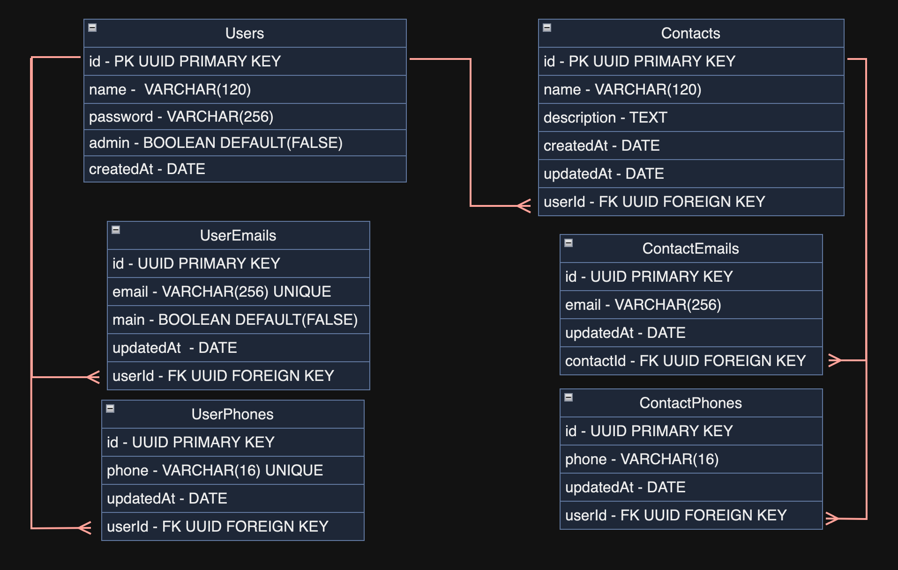

# Documentação da API
Introdução à API
## Tabela de Conteúdos

- [Visão Geral](#1-visão-geral)
- [Diagrama ER](#2-diagrama-er)
- [Início Rápido](#3-início-rápido)
    - [Instalando Dependências](#31-instalando-dependências)
    - [Variáveis de Ambiente](#32-variáveis-de-ambiente)
    - [Migrations](#33-migrations)

---

## 1. Visão Geral

Visão geral do projeto, um pouco das tecnologias usadas.

- [NodeJS](https://nodejs.org/en/)
- [Express](https://expressjs.com/pt-br/)
- [TypeScript](https://www.typescriptlang.org/)
- [PostgreSQL](https://www.postgresql.org/)
- [TypeORM](https://typeorm.io/)
- [JsonWebToken] (https://jwt.io/)
- [Zod] (https://zod.dev/)
- [UUID] (https://www.npmjs.com/package/uuid)
- [Swagger] (https://swagger.io/)
- [BCryptJS] (https://www.npmjs.com/package/bcryptjs)

A URL base da aplicação:
http://localhost:3000

---

## 2. Diagrama ER
[ Voltar para o topo ](#tabela-de-conteúdos)


Diagrama Entidade Relacionamento da API definindo relacionamentos entre Users, UserEmails, UserPhones, Contacts, ContactEmails e ContactPhones



---

## 3. Início Rápido
[ Voltar para o topo ](#tabela-de-conteúdos)


### 3.1. Instalando Dependências

Clone o projeto em sua máquina e instale as dependências com o comando:

```
npm install

```

### 3.2. Variáveis de Ambiente

Em seguida, crie um arquivo **.env**, copiando o formato do arquivo **.env.example**:


Configure suas variáveis de ambiente com suas credenciais do Postgres e uma nova database da sua escolha.

### 3.3. Migrations

Execute as migrations com o comando:

```
npm run typeorm migration:run -- -d src/data-source
```

---
## 4. Autenticação

Autenticação por JWT.

---

## 5. Endpoints, Schemas e Rotas

Acesse o endpoint /api-docs para abrir a documentação completa no formato swagger

